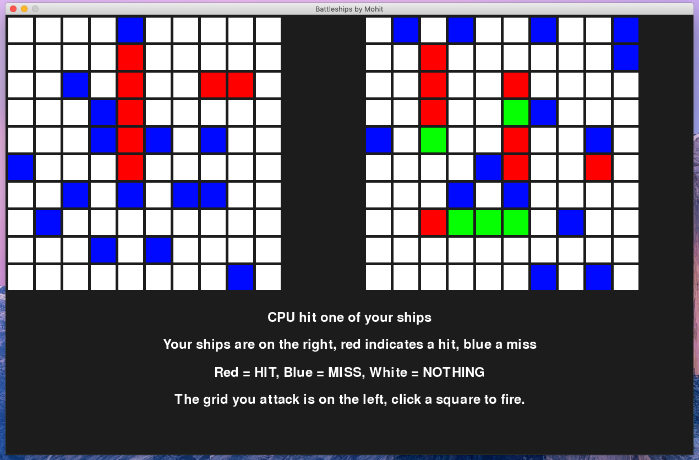

# Battleships
Battleships game, made with PyGame

# Requirements

Python 3

PyGame (pip3 install pygame)

## Screenshot


# Playing the game

To play, simply run the main.py file, and follow onscreen

In order to change the difficulty, observe LINE 22 in main.py, which is changable from 0 to 8 to change difficulty. In order to select difficulty on startup, simply change LINE 22 to:
```
DIFF_SET = int(input('Difficulty from 0 to 8: '))
```
